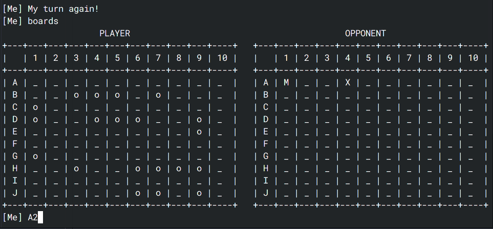

# battleships-game

A client-server, terminal based battleships game. Utilizes socket programming. 

# About
Battleships game is a one on one combat, where each player guesses the location of other player's ships. There are 4x 1-squared ships, 3x 2-squared ships, 2x 3-squared ships and 1 4-square ship. The player that guesses the locations of all of opponent's ships - wins.
If a player guessed some location correctly, he or she is entitled to another trial of guessing, and so forth until he misses.

Gameplay variations:

- gameplay possible on two different machines under the same network
- gameplay possible on the same machine under localhost address
- single player version possible with starting server as a _bot_

# Usage
Run `python server.py` and `python client.py` in order to start the game. You can specify IP of the server and port via cmd parameters. Use `-h` for help.

For server, you can use option `--bot` to daemonize the process and spawn a bot to play with!

# Screenshots
